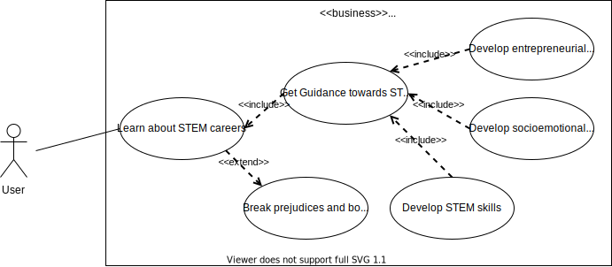
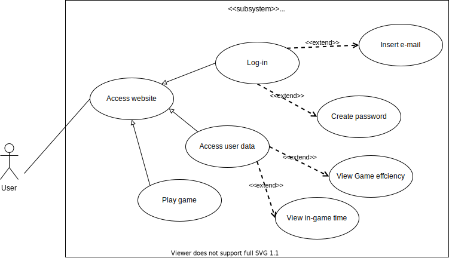
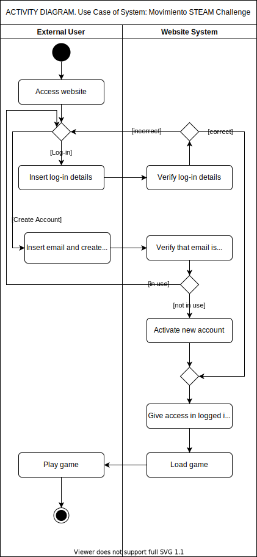

# UML Modeling

## Table of content

- [Business Use Case Model](#business-use-case-model)
- [Subsystem Use Case Model](#subsystem-use-case-model)
- [Activity Diagram](#activity-diagram)

## Business Use Case Model

## Subsystem Use Case Model

## Activity Diagram

